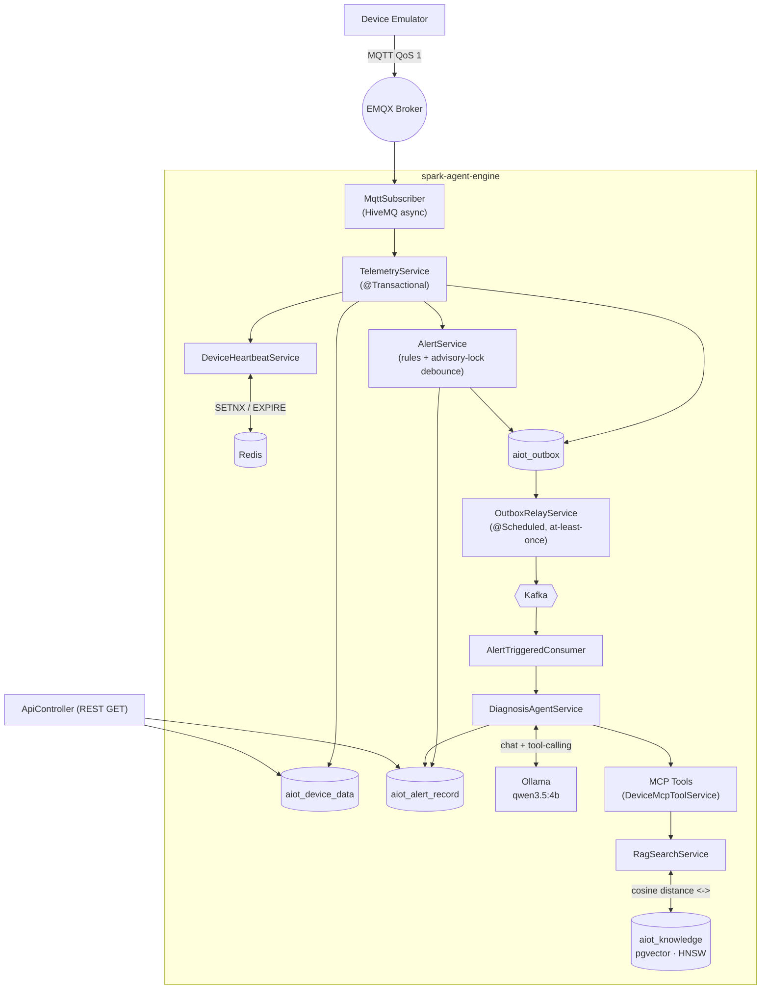

<div align="center">

# spark-agent-engine

**Industrial IoT telemetry ingestion, alerting, and autonomous AI root-cause diagnosis.**
One Spring Boot 4 / Java 25 service — from MQTT packet to LLM diagnosis, with no human in the loop.

[](./LICENSE)


**English** · [简体中文](./README.zh-CN.md)

</div>

---

## Table of Contents

- [Overview](#overview)
- [Background](#background)
- [Architecture](#architecture)
- [Core Features](#core-features)
- [Tech Stack](#tech-stack)
- [Database Schema Highlights](#database-schema-highlights)
- [Quick Start](#quick-start)
- [Screenshots & Demo](#screenshots--demo)
- [Related Projects](#related-projects)
- [Highlights](#highlights)
- [License](#license)

---

## 📖 Overview

Every property in an MQTT payload flows through one transactional pipeline: persisted to PostgreSQL, evaluated against alert rules, published to Kafka via a transactional outbox, and — when a rule fires — handed to an LLM agent that autonomously calls tools (device status, telemetry history, alert history, manual search) to produce a root cause, a confidence score, and a suggested fix, written straight back into the alert record.

```
✅ Phase 1 — Telemetry gateway        (MQTT → PostgreSQL → Kafka)
✅ Phase 2 — AI root-cause diagnosis  (Spring AI + Ollama + tool calling)
✅ Phase 3 — RAG knowledge base       (pgvector + HNSW)
✅ Phase 4 — MCP tool server          (for external AI agents)
```

All four phases are implemented and tested in this repository — not a roadmap, a shipped pipeline.

## 🧭 Background

Diagnosing an industrial device fault traditionally means an operator manually pulling up historical trends, cross-referencing the equipment manual, and guessing at a root cause under time pressure. That path doesn't scale and depends entirely on who's on shift.

**spark-agent-engine** closes that loop automatically. Telemetry arrives over MQTT, lands in the database, and any rule violation triggers an alert. A diagnosis agent then decides for itself which tools it needs — current device status, recent history, prior alerts, the relevant equipment manual chunk retrieved via vector search — and produces a structured verdict, gated by a confidence threshold that decides whether it's trustworthy enough to auto-resolve or needs a human to review it.

This repository is the **data and AI diagnosis engine** in the stack. The companion admin console (RBAC, device/rule configuration UI) lives in the sibling project [spark-iot-agent](../spark-iot-agent), sharing the same PostgreSQL schema.

## 🏗️ Architecture



## ⚙️ Core Features

| Module | What it does |
|---|---|
| **Telemetry ingestion** | Async HiveMQ MQTT 5 client, auto-reconnect + re-subscribe; a bad message is logged and skipped, never blocks the stream |
| **Device online state** | Redis `SETNX+EX` heartbeat with keyspace-notification-driven offline detection — zero DB writes while a device stays continuously online |
| **Alert rule engine** | 6 comparison operators as a type-safe enum (`gt/lt/gte/lte/eq/ne`), device-scoped or global rules, `pg_advisory_xact_lock` debounce that's correct across threads *and* instances |
| **Transactional outbox** | Telemetry and alert writes commit in the same transaction as their outbox row; a scheduled relay publishes to Kafka at-least-once — no more "DB rolled back but Kafka already saw it" |
| **AI root-cause diagnosis** | `DiagnosisAgentService` (Spring AI + Ollama) lets the LLM decide which tools to call before answering; low-confidence results trigger one retry with a widened history window |
| **MCP tool server** | `DeviceMcpToolService` exposes 5 `@Tool` methods — device list/status/history/alerts/manual search — usable by the diagnosis agent or any external MCP client |
| **RAG knowledge base** | Device manuals / SOPs / past incident write-ups are embedded with Ollama's `qwen3-embedding:0.6b` (1024-d) into pgvector, retrieved by cosine distance for diagnosis context |
| **REST query API** | Read-only endpoints for latest values, history, and recent alerts; response DTOs decoupled from JPA entities |

## 🧰 Tech Stack

| Category | Technology |
|---|---|
| **Backend** | Java 25 · Spring Boot 4.1.0 · Spring Framework 7 · Hibernate 7.4 · Gradle 9.5 |
| **Database** | PostgreSQL with the `pgvector` extension (HNSW index) · Spring Data JPA |
| **AI / LLM** | Spring AI 2.0 · Ollama (`qwen3.5:4b` for chat, `qwen3-embedding:0.6b` for embeddings) · MCP server (STREAMABLE protocol) |
| **Middleware** | EMQX (MQTT 5.0) · Apache Kafka 4.x (Spring for Apache Kafka) · Redis 7 (heartbeat + keyspace notifications) |
| **Reliability** | Transactional outbox pattern with a scheduled relay (at-least-once delivery) |
| **Misc.** | HiveMQ MQTT Client 1.3.15 (async API) · Jackson 3.x (`tools.jackson.*`) · Lombok · Snowflake ID generator |

## 🗄️ Database Schema Highlights

This service reads and writes the `aiot_*` tables; the schema itself is owned by the sibling admin console `spark-iot-agent` (`ddl-auto: none` — this service never touches DDL):

| Table | Design notes |
|---|---|
| `aiot_device` / `aiot_product` | Device-product association; `online_status` only flips on an actual offline↔online transition, not on every heartbeat |
| `aiot_device_data` | Telemetry rows — dual-column storage (`value` text + `value_num numeric(20,4)`); a composite index on `(device_key, identifier, report_time DESC) WHERE deleted=0` cut a full scan from ~68s to ~200ms at 80k rows; `findLatestByDeviceKey` uses a `ROW_NUMBER() OVER (PARTITION BY identifier)` window function instead of a correlated subquery |
| `aiot_alert_rule` / `aiot_alert_record` | `threshold` is stored as VARCHAR and parsed at evaluation time; a dedicated debounce index `(device_id, rule_id, trigger_time DESC) WHERE handle_status=0` supports the hot-path query fired on every telemetry message; `diagnosis_status/root_cause/suggestion/confidence` columns exist for the AI writeback |
| `aiot_knowledge` | **RAG vector table** — `embedding vector(1024)` holds `qwen3-embedding:0.6b` output, indexed `USING hnsw (embedding vector_cosine_ops)` for approximate nearest-neighbor search; `device_model`/`product_id` columns let queries narrow by equipment model before the vector search runs |
| `aiot_outbox` *(owned by this service)* | Transactional outbox landing table; a partial index `(created_at) WHERE published_at IS NULL` keeps the "pending" query fast, and a daily job purges published rows past the retention window |

All primary keys are `bigint`, generated by an in-process Snowflake ID generator (41-bit timestamp | 10-bit machine id | 12-bit sequence) — no DB auto-increment anywhere.

## 🚀 Quick Start

```bash
# 1. Start the middleware (EMQX / PostgreSQL+pgvector / Redis / Kafka —
#    provided by the sibling repo spark-ai-infra)
cd ../spark-ai-infra && docker compose up -d

# 2. Start Ollama locally and pull the models this service calls
ollama pull qwen3.5:4b
ollama pull qwen3-embedding:0.6b

# 3. Run the service (default port 8080)
./gradlew bootRun

# 4. Verify
curl http://localhost:8080/api/device/DK_INJ_001/latest
curl http://localhost:8080/api/alert/recent
```

> For a containerized deployment, this repo's own `docker-compose.yml` builds and runs just the app container, attaching to the external network (`spark-ai-infra_spark-net`) that the middleware above already created.

<details>
<summary>Known limitations (worth knowing before you read the code)</summary>

- No authentication or rate limiting on the REST API yet — fine for a local/portfolio deployment, not for exposing this publicly as-is.
- Ollama here runs with a single inference slot (`-np 1`), so `spring.kafka.listener.concurrency` is deliberately set to `1` — throughput is bound by the LLM backend, not Kafka partitioning.
- Schema migrations are tracked as plain `.sql` files under `sql/` and applied manually — there's no Flyway/Liquibase in this project yet.

</details>

Full setup details (schema bootstrap, Redis keyspace-notification config, running the test suite) are in [`AGENTS.md`](./AGENTS.md) / [`CLAUDE.md`](./CLAUDE.md).

## 📸 Screenshots & Demo

> TODO: add screenshots (alert list, AI diagnosis result view, RAG search hit example)

## 🔗 Related Projects

- [spark-iot-agent](../spark-iot-agent) — the RBAC admin console, for managing devices/products/alert rules; shares the `aiot_*` schema with this service
- [spark-iot-emulator](../spark-iot-emulator) — a device telemetry emulator that publishes MQTT messages to EMQX, used for local development and fault-scenario reproduction

## 💡 Highlights

- **Transactional outbox kills phantom data.** Telemetry and alert writes commit alongside their outbox row in the same transaction; a scheduled relay publishes to Kafka afterward. That turns a classic at-most-once bug — "the DB transaction rolled back but the Kafka message already went out" — into at-least-once delivery, using one table and one `@Scheduled` method.
- **The LLM decides its own diagnosis strategy.** `DiagnosisAgentService` doesn't stuff a fixed prompt with telemetry — it hands the model 5 MCP tools (device status, history, alerts, manual search) and lets it choose what to call. Below an 80% confidence threshold, it automatically retries once with a 120-minute widened history window.
- **pgvector + HNSW for millisecond semantic search.** Device manuals and incident write-ups are embedded into 1024-dimensional vectors and indexed with HNSW; combined with `device_model` metadata filtering, RAG lookups replace naive full-text search with sub-second approximate nearest-neighbor retrieval.
- **Database-level locking, not JVM locking, for alert debounce.** Deduplication moved from an in-JVM `synchronized` block to `pg_advisory_xact_lock`, verified with a dedicated concurrency test to hold across threads *and* across multiple service instances.
- **116 unit tests cover the hot paths.** Telemetry ingestion, all 6 alert operators, outbox relay, diagnosis confidence branching, and MCP tool mapping are each independently tested — core-path changes get verified in seconds locally, not in a shared staging environment.

## 📄 License

Released under the [MIT License](./LICENSE).
