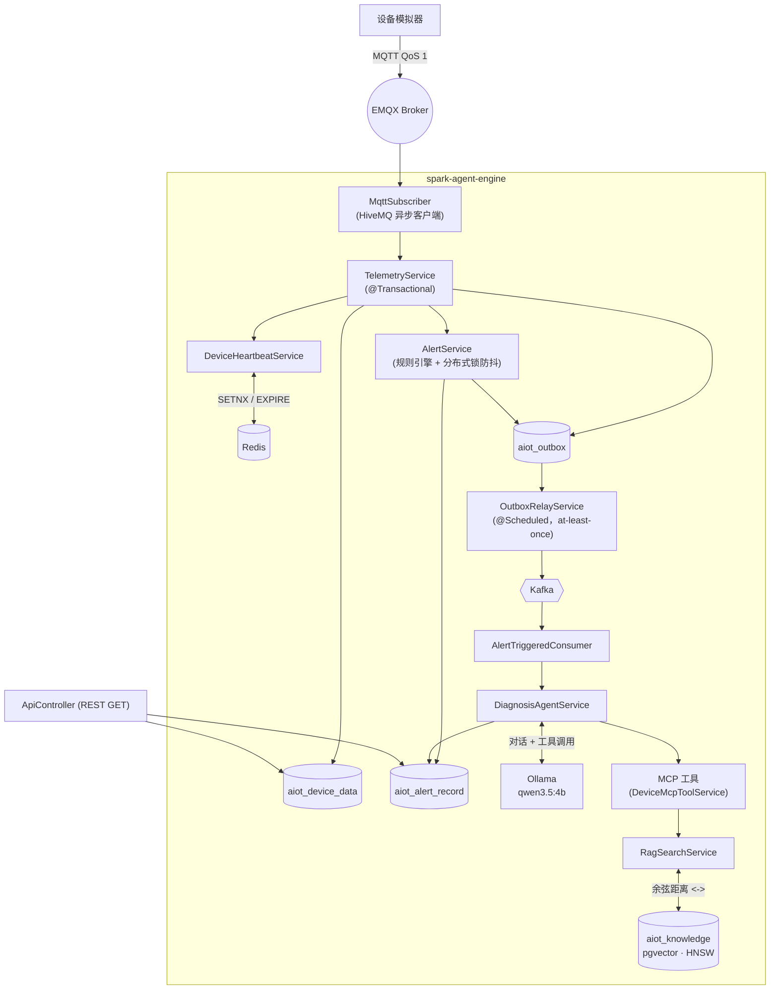

<div align="center">

# spark-agent-engine

**工业 IoT 设备遥测接入、规则告警与自主 AI 根因诊断引擎。**
一个 Spring Boot 4 / Java 25 服务 —— 从一条 MQTT 报文，到一份 LLM 诊断结论，全程无需人工介入。

[](./LICENSE)


[English](./README.md) · **简体中文**

</div>

---

## 目录

- [项目概述](#项目概述)
- [项目背景](#项目背景)
- [系统架构](#系统架构)
- [核心功能](#核心功能)
- [技术栈](#技术栈)
- [数据库设计亮点](#数据库设计亮点)
- [快速开始](#快速开始)
- [项目截图 / 演示](#项目截图--演示)
- [相关项目](#相关项目)
- [技术亮点](#技术亮点)
- [许可证](#许可证)

---

## 📖 项目概述

MQTT 报文里的每一个属性都流经同一条事务性管道：写入 PostgreSQL、匹配告警规则、经事务性 Outbox 发布到 Kafka；一旦规则触发，诊断 Agent 便会自主调用工具（设备状态、遥测历史、告警历史、设备手册检索）产出根因、置信度与处置建议，并直接回写到告警记录中。

```
✅ 阶段一 —— 数据接入网关     (MQTT → PostgreSQL → Kafka)
✅ 阶段二 —— AI 根因诊断      (Spring AI + Ollama + 工具调用)
✅ 阶段三 —— RAG 知识库       (pgvector + HNSW)
✅ 阶段四 —— MCP 工具服务     (供外部 AI Agent 调用)
```

四个阶段均已在本仓库中实现并配有测试 —— 不是规划，是已交付的完整链路。

## 🧭 项目背景

工业设备的异常诊断长期依赖人工经验：设备离线、超温、超压等异常发生后，运维人员需要手动翻查历史数据、比对设备手册、判断根因，响应慢且高度依赖个人经验，也无法规模化。

**spark-agent-engine** 把这条链路完全自动化。设备数据经 MQTT 实时接入并落库，任意规则被触发即产生告警；诊断 Agent 随后自主决定需要哪些信息 —— 设备当前状态、近期历史、既往告警、经向量检索命中的设备手册片段 —— 并给出结构化诊断结论，由置信度阈值决定该结论是可以自动采信，还是需要转交人工复核。

本仓库是整套系统里的**数据与 AI 诊断引擎**；配套的管理后台（RBAC、设备/规则配置界面）由姊妹项目 [spark-iot-agent](../spark-iot-agent) 提供，两者共享同一套 PostgreSQL 表结构。

## 🏗️ 系统架构



## ⚙️ 核心功能

| 模块 | 说明 |
|---|---|
| **遥测接入** | HiveMQ 异步客户端订阅 MQTT 5，断线自动重连并重新订阅；单条异常消息记录日志后跳过，不阻塞后续消息 |
| **设备在线状态** | Redis `SETNX+EX` 心跳，配合键空间通知事件驱动下线检测；设备持续在线期间零数据库写入 |
| **告警规则引擎** | 6 种比较运算符（`gt/lt/gte/lte/eq/ne`），类型安全枚举实现；支持设备级/全局规则；`pg_advisory_xact_lock` 防抖，跨线程、跨实例均保证正确 |
| **事务性 Outbox** | 遥测与告警写入与 Outbox 记录同事务提交，定时中继按 at-least-once 语义转发 Kafka —— 彻底消除"DB 回滚但 Kafka 已发出"的幽灵数据问题 |
| **AI 根因诊断** | `DiagnosisAgentService`（Spring AI + Ollama）让 LLM 自主决定调用哪些工具后再作答；置信度不足时自动扩大历史时间窗口重试一次 |
| **MCP 工具服务** | `DeviceMcpToolService` 暴露 5 个 `@Tool` 方法（设备列表/状态/历史/告警/手册检索），供诊断 Agent 及任意外部 MCP 客户端调用 |
| **RAG 知识库** | 设备手册、SOP、历史故障案例经 Ollama `qwen3-embedding:0.6b` 编码为 1024 维向量存入 pgvector，按余弦距离检索为诊断提供上下文 |
| **REST 查询接口** | 只读接口，返回最新值、历史数据与近期告警；响应 DTO 与 JPA 实体解耦 |

## 🧰 技术栈

| 分类 | 技术 |
|---|---|
| **后端** | Java 25 · Spring Boot 4.1.0 · Spring Framework 7 · Hibernate 7.4 · Gradle 9.5 |
| **数据库** | PostgreSQL（`pgvector` 扩展，HNSW 索引）· Spring Data JPA |
| **AI / LLM** | Spring AI 2.0 · Ollama（`qwen3.5:4b` 推理 / `qwen3-embedding:0.6b` 向量化）· MCP Server（STREAMABLE 协议） |
| **中间件** | EMQX（MQTT 5.0）· Apache Kafka 4.x（Spring for Apache Kafka）· Redis 7（心跳 + 键空间通知） |
| **可靠性** | 事务性 Outbox 模式 + 定时中继（at-least-once） |
| **其他** | HiveMQ MQTT Client 1.3.15（异步 API）· Jackson 3.x（`tools.jackson.*`）· Lombok · 雪花 ID 生成器 |

## 🗄️ 数据库设计亮点

本服务读写 `aiot_*` 系列表，Schema 由姊妹项目 `spark-iot-agent`（RBAC 管理后台）统一维护，本服务 `ddl-auto: none`，只读写不建表：

| 表 | 关键设计 |
|---|---|
| `aiot_device` / `aiot_product` | 设备-产品关联；`online_status` 仅在真正的离线↔在线状态转换时更新，而非每次心跳都写库 |
| `aiot_device_data` | 遥测明细表，`value`（文本）+ `value_num`（`numeric(20,4)`）双列存储；`(device_key, identifier, report_time DESC) WHERE deleted=0` 复合索引把 8 万行的全表扫描从约 68 秒降到约 200 毫秒；`findLatestByDeviceKey` 用 `ROW_NUMBER() OVER (PARTITION BY identifier)` 窗口函数替代关联子查询 |
| `aiot_alert_rule` / `aiot_alert_record` | `threshold` 以 VARCHAR 存储、运行时解析；专用防抖索引 `(device_id, rule_id, trigger_time DESC) WHERE handle_status=0` 支撑每条遥测消息都会触发的热路径查询；`diagnosis_status/root_cause/suggestion/confidence` 字段为 AI 诊断回写预留 |
| `aiot_knowledge` | **RAG 向量表** —— `embedding vector(1024)` 存储 `qwen3-embedding:0.6b` 生成的语义向量，`USING hnsw (embedding vector_cosine_ops)` 索引支撑近似最近邻检索；`device_model`/`product_id` 字段支持"先按设备型号收窄范围、再做向量检索"的组合过滤 |
| `aiot_outbox`（本服务自有） | 事务性 Outbox 落地表；部分索引 `(created_at) WHERE published_at IS NULL` 让"待发布消息"查询保持高效；每日定时任务清理超出保留期的已发布记录 |

所有主键均为 `bigint`，由内置雪花算法生成（41 位时间戳 | 10 位机器号 | 12 位序列），不依赖数据库自增。

## 🚀 快速开始

```bash
# 1. 启动中间件（EMQX / PostgreSQL(pgvector) / Redis / Kafka，
#    由姊妹仓库 spark-ai-infra 提供）
cd ../spark-ai-infra && docker compose up -d

# 2. 本机启动 Ollama 并拉取本服务用到的模型
ollama pull qwen3.5:4b
ollama pull qwen3-embedding:0.6b

# 3. 启动本服务（默认端口 8080）
./gradlew bootRun

# 4. 验证
curl http://localhost:8080/api/device/DK_INJ_001/latest
curl http://localhost:8080/api/alert/recent
```

> 容器化部署可直接使用本仓库自带的 `docker-compose.yml`，它只构建并运行 app 容器，接入上述中间件已创建好的外部网络 `spark-ai-infra_spark-net`。

<details>
<summary>已知限制（读代码前值得了解一下）</summary>

- REST API 目前没有鉴权与限流 —— 用于本地开发/作品集展示没问题，直接对公网暴露则不建议。
- 本机 Ollama 只开了单条推理并发（`-np 1`），因此 `spring.kafka.listener.concurrency` 特意设为 `1` —— 吞吐上限由 LLM 后端决定，而非 Kafka 分区数。
- 表结构变更以 `sql/` 目录下的纯 `.sql` 文件手动记录并应用，项目里暂未引入 Flyway/Liquibase 之类的迁移工具。

</details>

更完整的环境搭建（表结构初始化、Redis 键空间通知配置、单测运行方式）见 [`AGENTS.md`](./AGENTS.md) / [`CLAUDE.md`](./CLAUDE.md)。

## 📸 项目截图 / 演示

> TODO: 添加截图（告警列表、AI 诊断结果展示、RAG 检索命中示例）

## 🔗 相关项目

- [spark-iot-agent](../spark-iot-agent) —— 提供设备/产品/告警规则的 RBAC 管理界面，与本服务共享 `aiot_*` 表结构
- [spark-iot-emulator](../spark-iot-emulator) —— 设备遥测模拟器，向 EMQX 发布 MQTT 遥测消息，用于本地开发与故障场景复现

## 💡 技术亮点

- **事务性 Outbox 消除幽灵数据**：遥测/告警写入与 Outbox 记录同一事务提交，定时中继转发 Kafka，把"DB 回滚但消息已发出"这个经典 at-most-once 缺陷，用一张表 + 一个 `@Scheduled` 方法升级为 at-least-once 语义。
- **LLM 自主决定诊断策略**：`DiagnosisAgentService` 不是把遥测硬塞进固定 Prompt，而是把 5 个 MCP 工具（设备状态/历史/告警/手册检索）交给模型自主决策调用；诊断置信度低于 80% 时，自动扩大到 120 分钟历史窗口重试一次。
- **pgvector + HNSW 实现毫秒级语义检索**：设备手册与故障案例被编码为 1024 维向量并建立 HNSW 索引，配合 `device_model` 元数据过滤，让 RAG 检索用近似最近邻取代传统全文检索，响应稳定在亚秒级。
- **数据库级锁替代 JVM 级锁做告警防抖**：去重机制从最初的 JVM 内 `synchronized` 升级为 `pg_advisory_xact_lock`，并用专门的并发测试验证跨线程、跨实例场景下均不产生重复告警。
- **116 个单元测试覆盖核心链路**：遥测入库、6 种告警运算符、Outbox 中继、诊断置信度分支、MCP 工具映射均有独立测试覆盖，核心链路的改动可在本地秒级验证，无需依赖联调环境。

## 📄 许可证

本项目基于 [MIT License](./LICENSE) 开源。
